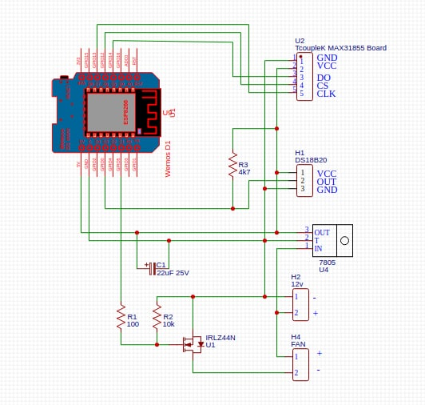
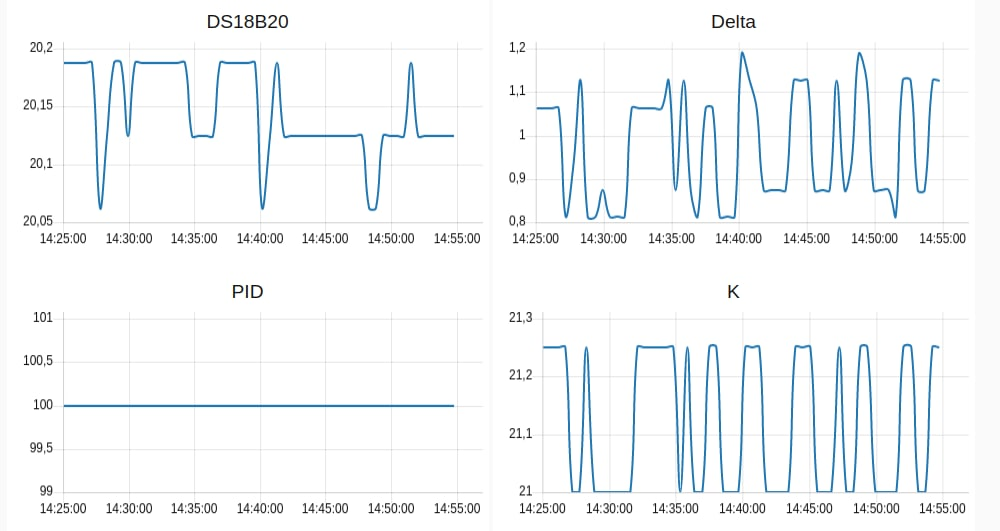
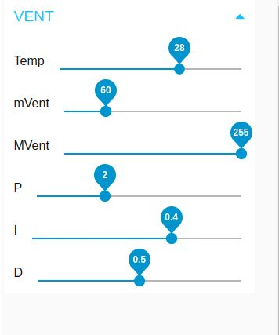
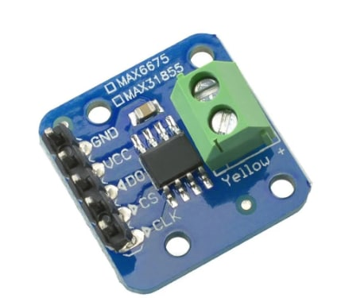

# Caminetto 
Lo scopo di questo progetto è di estrarre l'aria calda dalla cabina in cartongesso del caminetto e portarla verso la stanza.
<ul>
  <li>Sfrutta una sonda DS18B20 per rilevare la temperatura.</li>
  <li>Una ventola a 12v per il movimento dell'aria.</li>
  <li>Attraverso un Mosfet ed il PWM varia la tensione applicata alla ventola.</li>
  <li>Il PWM viene gestito via PID.</li>
  <li>In aggiunta un termocoppia K visualizza la temperatura dei fumi/canna fumaria del caminetto.</li>
  <li>I dati sulle temperature e la velocità della ventola sono visualizzabili via browser.</li>
</ul>

Schema elettrico

Esempio visualizzazione

Particolare regolazione parametri PID

Scheda termocoppia

